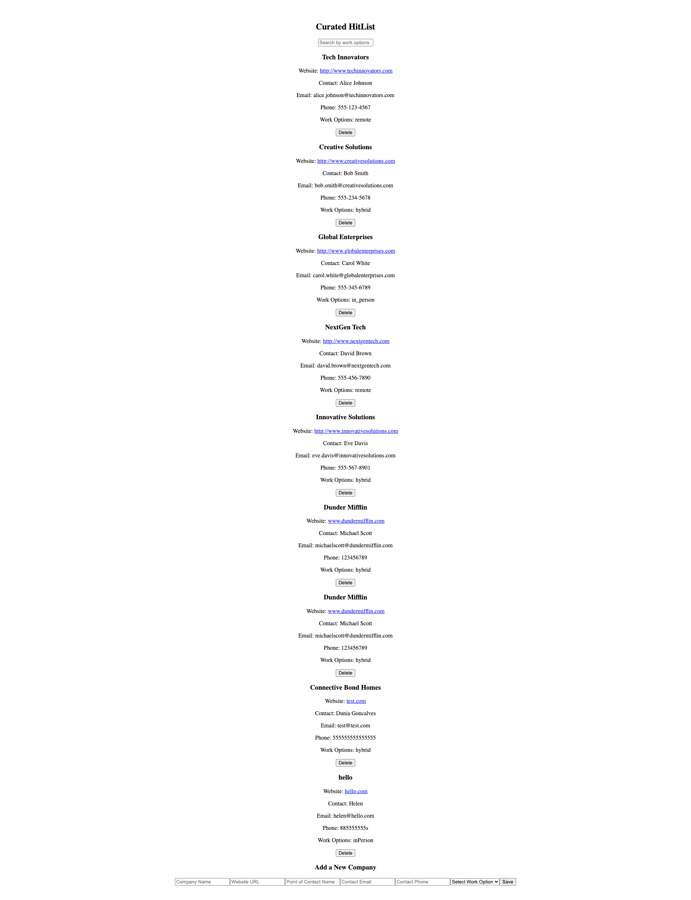
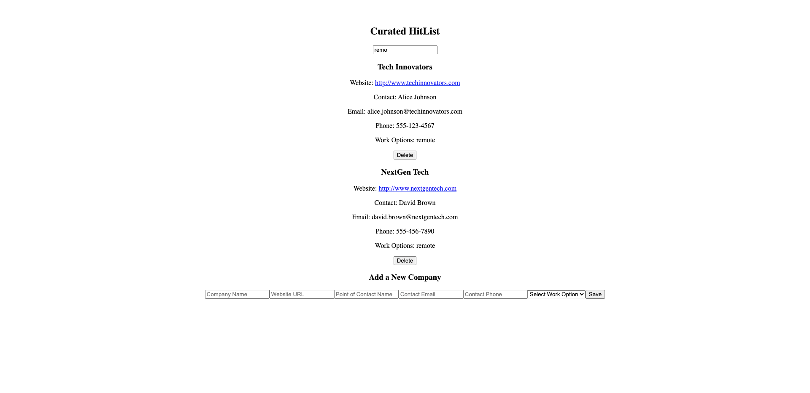
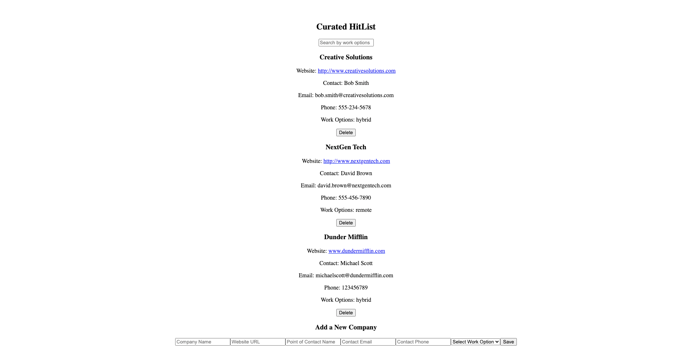
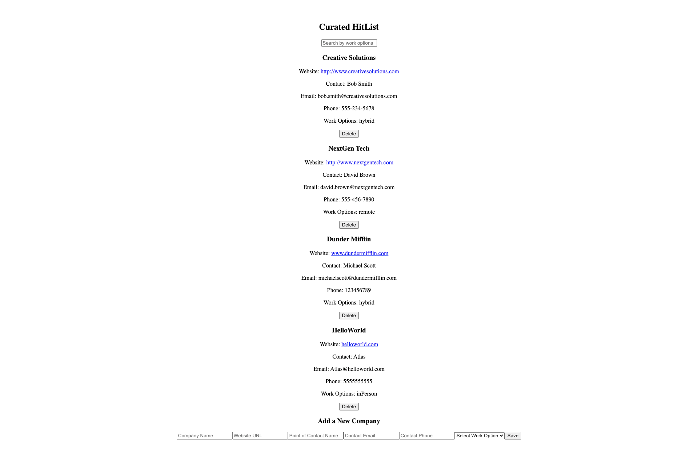

# Curated HitList

A React-based application for managing a curated list of companies. Users can add, delete, and filter companies. Data is stored and managed using **JSON Server**.

## 🚀 Features

- ✅ **Add a Company**: Users can add a new company with relevant details.
- ✅ **Delete a Company**: Users can delete.
- ✅ **Filter Companies**: Users can filter companies by work options in real-time.
- ✅ **Persistent Data**: Companies are stored in a JSON Server backend.
- ✅ **Error Handling**: Basic error handling implemented for API requests.

## Getting Started

### Prerequisites

- Node.js installed on your system.

### Installation

1. Clone the repository:

   ```bash
   git clone https://github.com/your-username/curated-hitlist.git
   cd curated-hitlist
   ```

2. Install dependencies:

   ```bash
   npm install
   ```

3. Start the JSON Server:

   ```bash
   npx json-server --watch db.json --port 3001
   ```

4. Run the React application:

   ```bash
   npm run dev
   ```

## Usage

- **Add Company**: Use the form to add a new company with the following fields:
  - Company Name
  - Website
  - Point of Contact (Name, Email, Phone)
  - Work Options (Remote, Hybrid, In Person)
- **Delete Company**: Click the **Delete** button to remove a company (with confirmation).
- **Filter Companies**: Use the search input to filter companies by work options.

## Definition of Done

- [x] Companies should be saved in **JSON Server**.
- [x] User should be able to **add companies**.
- [x] User should be able to **delete companies** (with confirmation and database removal).
- [x] User should be able to **filter companies** by work options.
- [x] Implement **error handling** for at least one API request.

## To-Do

- [ ] **Style the application with Bootstrap** for a cleaner UI.
- [ ] **Remove company from the database**, not just the DOM.
- [ ] **Confirm deletion**: Ask the user "Are you sure?" before deleting.
- [ ] **Input Validation**: Ensure appropriate regulations:
  - Phone numbers should only accept valid numeric formats.

## 📸 Screenshot






#### React + Vite

This template provides a minimal setup to get React working in Vite with HMR and some ESLint rules.

Currently, two official plugins are available:

- [@vitejs/plugin-react](https://github.com/vitejs/vite-plugin-react/blob/main/packages/plugin-react/README.md) uses [Babel](https://babeljs.io/) for Fast Refresh
- [@vitejs/plugin-react-swc](https://github.com/vitejs/vite-plugin-react-swc) uses [SWC](https://swc.rs/) for Fast Refresh
